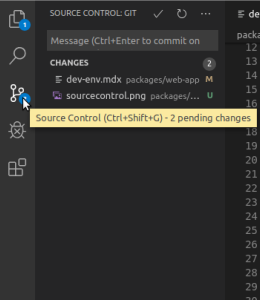
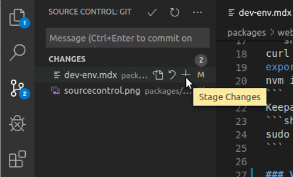
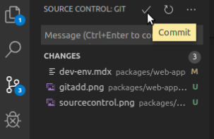
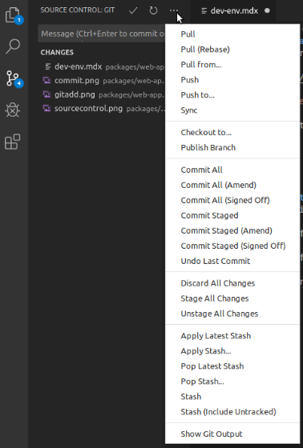

## Required software

Chromium

```sh
sudo apt install chromium-browser
```

Node and npm

```sh
curl -o- https://raw.githubusercontent.com/nvm-sh/nvm/v0.34.0/install.sh | bash
export NVM_DIR="$([ -z "${XDG_CONFIG_HOME-}" ] && printf %s "${HOME}/.nvm" || printf %s "${XDG_CONFIG_HOME}/nvm")" [ -s "$NVM_DIR/nvm.sh" ] && \. "$NVM_DIR/nvm.sh" # This loads nvm
nvm install 8
```
Keepass
```sh
sudo apt install keepassx
```

### VsCode
#### Installation
The repository and key can also be installed manually with the following script:
```sh
curl https://packages.microsoft.com/keys/microsoft.asc | gpg --dearmor > packages.microsoft.gpg
sudo install -o root -g root -m 644 packages.microsoft.gpg /usr/share/keyrings/
sudo sh -c 'echo "deb [arch=amd64 signed-by=/usr/share/keyrings/packages.microsoft.gpg] https://packages.microsoft.com/repos/vscode stable main" > /etc/apt/sources.list.d/vscode.list'
```
Then update the package cache and install the package using:
```sh
sudo apt-get install apt-transport-https
sudo apt-get update
sudo apt-get install code
```
#### Instructions for using Git through VScode
1. After typing some code and save, click Source Control or press `<Ctrl + Shift + g>`:
    <p>  </p>
2. Instead of git adding from terminal, click the plus icon:
    <p>  </p>
3. Instead of git commiting from terminal, type your commit message in the "Message" iput box and click the check icon:
    <p>  </p>
4. Publish branch, push, pull and more from the "three dots" icon:
    <p>  </p>