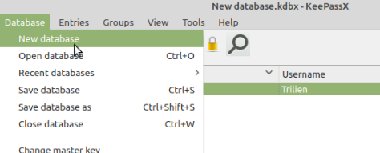
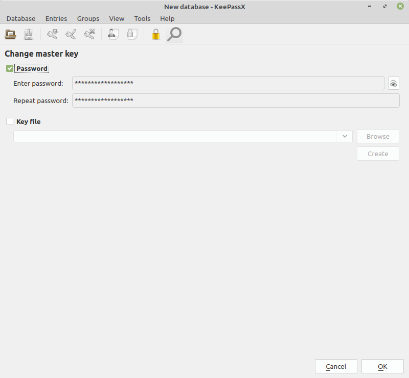
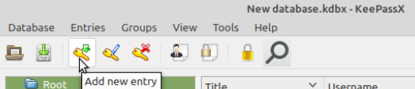
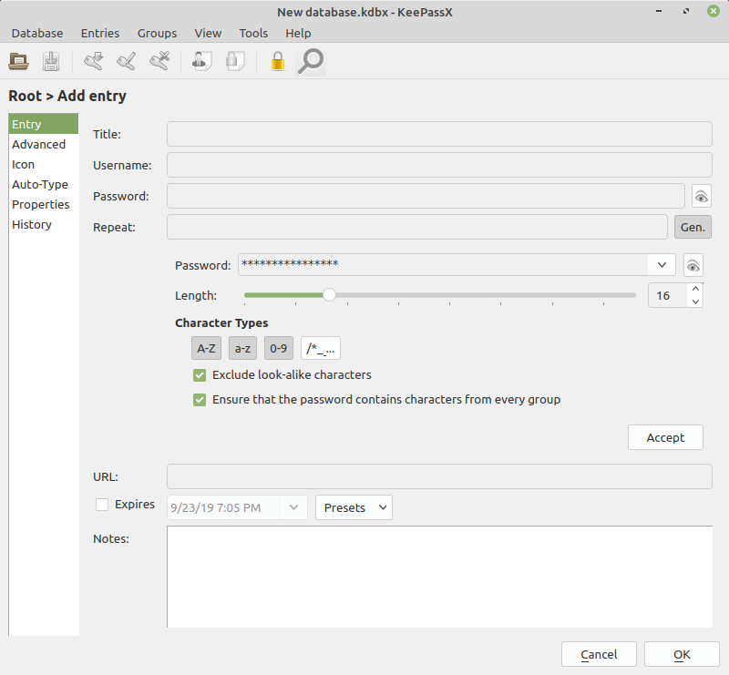
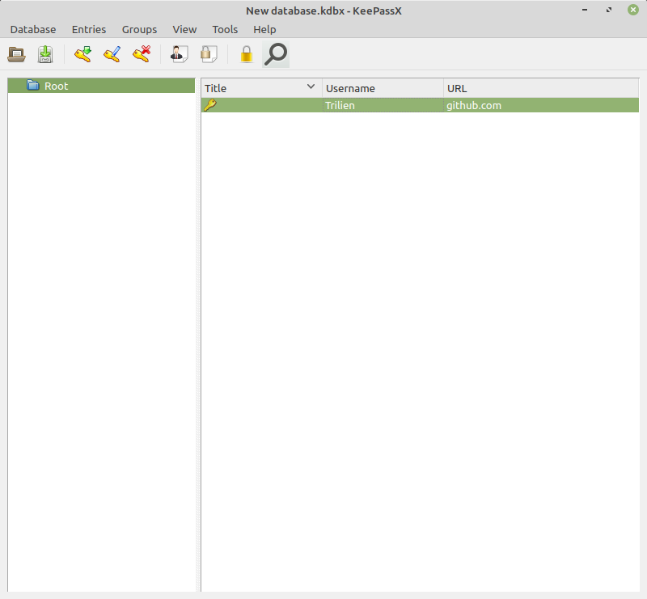

## Required software
##TODO Style chromium section and add info for dev tools 
Chromium

```sh
sudo apt install chromium-browser
```

##Style nvm/node section and add info for nvm usage
##fix bug with export
Node and npm
```sh
curl -o- https://raw.githubusercontent.com/nvm-sh/nvm/v0.34.0/install.sh | bash
export NVM_DIR="$([ -z "${XDG_CONFIG_HOME-}" ] && printf %s "${HOME}/.nvm" || printf %s "${XDG_CONFIG_HOME}/nvm")" [ -s "$NVM_DIR/nvm.sh" ] && \. "$NVM_DIR/nvm.sh" # This loads nvm
nvm install 8
```

### Keepass
#### Installation
```sh
sudo apt install keepassx
```
#### Instructions
- Launch keepass from Menu or from terminal:
```sh
keepassx
```
- The first time you launch keepass click Database -> New Database:
  <p>  </p>

- Enter a strong password (a-z, 0-9, symbols). It is the only password YOU MUST remember from now on. Click "OK":
    <p>  </p>
    HINT: Forgetting this password makes your password database inaccessible.

- When it comes to register to a website:
    1. click "Add new entry":
    <p>  </p>

    2. Enter the corresponding url, your username and press "Gen." then "Accept" and "OK". Keepass will produce a strong possword for you to use. Copy it and paste it to "Password" and "Confirm Password" inputs of the registration page:
    <p>  </p>

- When it comes to sign in to a website:
    1. Click at username/e-mail input field at your browser.
    2. Launch keepass and enter the database password.
    3. Select the corresponding entry for the url you want to log in to:
       <p>  </p>
    4. Press `<Ctrl + v>` and keepass will automatically sign you in to your account.

- Use keepass for storing ssh keys https://julien.coubronne.net/en/2016/07/15/store-your-ssh-keys-in-keepass-and-use-them-with-keeagent/

##TODO Style and expand info for vscode 
##add usage instructions for using git through vscode with screenshots
VsCode
The repository and key can also be installed manually with the following script:
```sh
curl https://packages.microsoft.com/keys/microsoft.asc | gpg --dearmor > packages.microsoft.gpg
sudo install -o root -g root -m 644 packages.microsoft.gpg /usr/share/keyrings/
sudo sh -c 'echo "deb [arch=amd64 signed-by=/usr/share/keyrings/packages.microsoft.gpg] https://packages.microsoft.com/repos/vscode stable main" > /etc/apt/sources.list.d/vscode.list'
```
Then update the package cache and install the package using:
```sh
sudo apt-get install apt-transport-https
sudo apt-get update
sudo apt-get install code
```